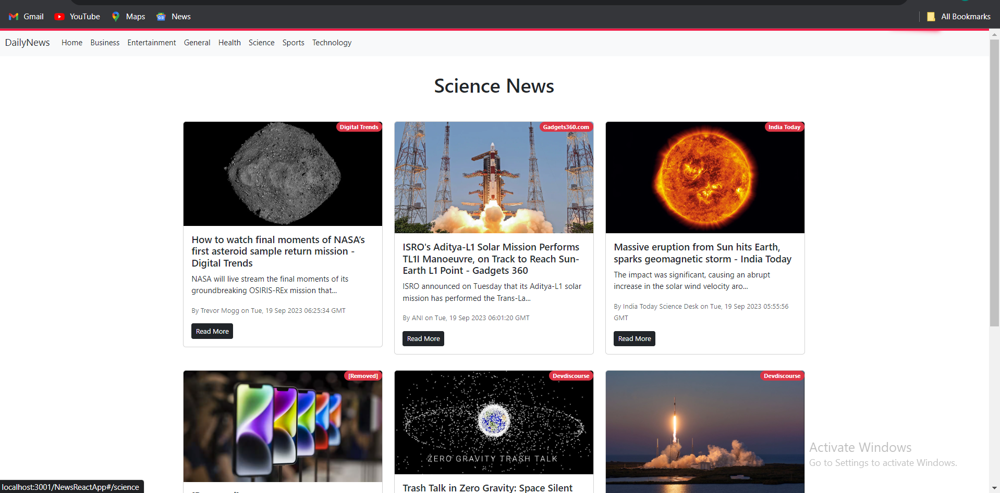

# Daily News App

Welcome to the Daily News App repository! This project is a web application that provides users with the latest news articles from various sources.


## Table of Contents

- [About the Project](#about-the-project)
- [Features](#features)
- [Tech Stack](#tech-stack)
- [Getting Started](#getting-started)
- [Usage](#usage)
- [Project Structure](#project-structure)
- [Contributing](#contributing)


## About the Project

The Daily News App is designed to keep users informed about the latest news from different categories such as technology, business, entertainment, and more. Users can browse headlines, read detailed articles, and stay up-to-date with current events.

## Features

- **Headlines Section:**
  - Display top news headlines from various sources.
- **Categories Section:**
  - Explore news articles categorized by topics like technology, business, sports, etc.
- **Search Functionality:**
  - Search for specific news articles based on keywords.
- **Detailed Articles:**
  - Read full articles with detailed information.
- **Responsive Design:**
  - User-friendly design that adapts to different screen sizes.

## Tech Stack

- React.js
- JavaScript (ES6+)
- Bootstrap


## Getting Started

These instructions will help you set up the project on your local machine.

### Prerequisites

- Node.js installed on your machine.

### Installation

1. **Clone the repository:**

   ```bash
   git clone https://github.com/2212rutuja/DailyNewsApp.git
   cd DailyNewsApp

### Usage
Explore the latest news, read articles, and stay informed with the Daily News App.

### Project Structure
The project structure is organized with React components, styles, and API calls to fetch news data.

### Contributing
Contributions are welcome! If you have suggestions or find issues, feel free to open an issue or submit a pull request.
